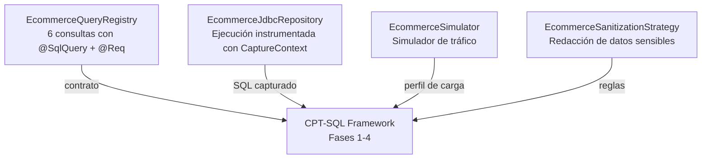

# sql-testing-demo

Proyecto de referencia que consume el framework
[CPT-SQL](https://github.com/Alizeci/CPT-SQL) para demostrar la
detección continua de degradaciones de rendimiento en consultas SQL
sobre una aplicación Java real.

Simula una plataforma de e-commerce con seis consultas anotadas, acceso
JDBC puro a PostgreSQL y los cuatro workflows de CI/CD del framework
integrados. Sirve como plantilla replicable para adoptar CPT-SQL en
otros proyectos Java.

## Qué demuestra este proyecto

- **Integración de CPT-SQL** en una aplicación Java sin modificar el
  núcleo del framework (se consume como dependencia externa).
- **Instrumentación con `@SqlQuery` y `@Req`** sobre seis consultas del
  dominio de e-commerce (catálogo, inventario, órdenes, analítica).
- **Captura no invasiva** del SQL real mediante `CaptureContext` en el
  repositorio JDBC.
- **Cuatro workflows CI/CD** de GitHub Actions que ejecutan el pipeline
  completo: gate de PR, actualización de baseline, benchmark nocturno
  y captura de perfil productivo.
- **Artefactos persistidos** en el repositorio (`baseline.json`,
  `load-profile.json`) para reproducibilidad end-to-end.

## Cómo funciona



- **`EcommerceQueryRegistry`** declara las seis consultas del dominio
  y su contrato de rendimiento en tiempo de compilación. El procesador
  de anotaciones de CPT-SQL genera `queries.json` durante `./gradlew
  compileJava`.
- **`EcommerceJdbcRepository`** ejecuta cada consulta contra la base
  de datos usando `CaptureContext` para vincular la ejecución con su
  `queryId`, permitiendo la captura no invasiva del SQL real.
- **`EcommerceSimulator`** simula tráfico realista con distribución de
  mezcla de operaciones para generar el `load-profile.json`.
- **`EcommerceSanitizationStrategy`** implementa la interfaz
  `SanitizationStrategy` de CPT-SQL para redactar valores sensibles
  del dominio antes de la persistencia.

## Consultas del dominio

Las seis consultas anotadas con sus contratos de rendimiento:

| queryId | SLA (p95) | Prioridad | Descripción |
|---|---|---|---|
| `searchProductsByCategory` | 300 ms | HIGH | Búsqueda multi-filtro sobre catálogo, ranking por rating |
| `getProductDetail` | 50 ms | HIGH | Lookup por PK del producto |
| `checkInventory` | 30 ms | HIGH | Consulta de stock disponible |
| `updateInventory` | 100 ms | HIGH | Descuento de stock post-venta |
| `createOrder` | 200 ms | HIGH | Inserción transaccional de una nueva orden |
| `salesDashboard` | 2.500 ms | MEDIUM | Analítica agregada por período y categoría |

Todas las consultas SQL están declaradas en `EcommerceQueryRegistry` con
Javadoc explicando su papel en el flujo de negocio y su comportamiento
esperado bajo carga. Los detalles de comportamiento bajo carga, escenarios
de degradación y resultados empíricos de estas seis consultas se
documentan en el capítulo 6.5 del trabajo de grado.

## Requisitos

- Java 17+
- Docker (para la base de datos espejo, levantada automáticamente por CPT-SQL)
- Gradle (incluye wrapper `./gradlew`)
- Framework [CPT-SQL](https://github.com/Alizeci/CPT-SQL) publicado a Maven Local

## Setup local

Este demo consume CPT-SQL como dependencia de Maven Local. Antes de correrlo,
publica el framework desde su propio repositorio:

```bash
# En el repo CPT-SQL (una sola vez, publica el framework a Maven Local)
git clone https://github.com/Alizeci/CPT-SQL.git
cd CPT-SQL && ./gradlew publishToMavenLocal && cd ..
```

Luego, desde este repo:

```bash
git clone https://github.com/Alizeci/sql-testing-demo.git
cd sql-testing-demo

# Compilar (genera queries.json en el classpath vía SqlQueryProcessor)
./gradlew compileJava

# Ejecutar el simulador de tráfico para capturar el perfil (Fase 2)
./gradlew runSimulator

# Ejecutar el benchmark completo contra la base de datos espejo (Fases 3 y 4)
./gradlew bootRun
```

El `MirrorDatabaseProvisioner` de CPT-SQL levanta automáticamente el
contenedor Docker de PostgreSQL 17 con el esquema definido en
`src/main/resources/schema-ecommerce.sql`. No se requiere configuración
manual de Docker.

## Configuración

Los parámetros principales están en `src/main/resources/application.properties`.
Para calibrar el detector u otros aspectos del framework, ver la
[documentación de configuración de CPT-SQL](https://github.com/Alizeci/CPT-SQL/tree/main#configuración).

## Workflows CI/CD

| Workflow | Disparador | Propósito |
|---|---|---|
| `light-benchmark.yml` | Pull request | Gate proactivo con 400k filas sintéticas (perfil light) |
| `update-baseline.yml` | Push a `main` post-merge | Actualiza `baseline.json` con el resultado de la rama principal |
| `nightly-benchmark.yml` | Cron nocturno (07:00 UTC) | Validación a escala productiva con 2M filas (perfil normal) |
| `capture-production-profile.yml` | Manual (workflow_dispatch) | Captura del perfil de tráfico real desde una base con datos representativos |

Los cuatro workflows invocan componentes reutilizables publicados por
el framework CPT-SQL, sin duplicar la lógica de orquestación.

## Estructura del proyecto

    sql-testing-demo/
    ├── src/main/java/escuelaing/edu/co/demo/
    │   ├── EcommerceQueryRegistry.java               # Contratos de rendimiento
    │   ├── EcommerceJdbcRepository.java              # Ejecución instrumentada
    │   ├── EcommerceSimulator.java                   # Simulador de tráfico
    │   └── EcommerceSanitizationStrategy.java        # Redacción de valores sensibles
    ├── src/main/resources/
    │   ├── application.properties                    # Configuración del framework
    │   ├── schema-ecommerce.sql                      # DDL del dominio
    │   └── seed-ecommerce-400k.sql                   # Seed de la base de captura
    ├── src/test/java/escuelaing/edu/co/demo/
    │   └── EcommerceSanitizationStrategyTest.java    # Pruebas unitarias
    ├── .github/workflows/                            # Cuatro workflows de CI/CD
    ├── baseline.json                                 # Baseline aprobado
    ├── load-profile.json                             # Perfil de carga capturado
    ├── build.gradle
    ├── LICENSE
    ├── NOTICE
    └── README.md

## Ver también

- [CPT-SQL](https://github.com/Alizeci/CPT-SQL) — El framework que este
  proyecto consume.
- **Trabajo de grado**: Izquierdo Castro, L. A. (2026). *Diseño y
  desarrollo de un sistema de pruebas de carga continua para consultas
  SQL durante el ciclo de vida del software*. Escuela Colombiana de
  Ingeniería Julio Garavito.

## Licencia

Distribuido bajo [Apache License 2.0](LICENSE). Ver [`NOTICE`](NOTICE)
para atribuciones específicas.
